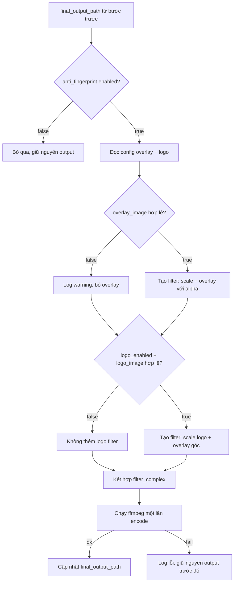

# Design Document: Video Anti-Fingerprint

## Overview

Tính năng Video Anti-Fingerprint thêm hai lớp xử lý hình ảnh vào pipeline video hiện có:

1. **Overlay ảnh bán trong suốt** — phủ toàn bộ khung hình với opacity thấp (mặc định 2%), khiến các bot quét fingerprint nhận diện lớp overlay thay vì nội dung gốc.
2. **Logo thương hiệu** — đặt ở góc video với kích thước tối đa 15% chiều rộng video và padding 10px.

Cả hai được thực hiện trong **một lần encode ffmpeg duy nhất** (filter_complex), tích hợp sau bước burn subtitles + voice conversion trong `process_video_full()`. Tính năng có thể bật/tắt và cấu hình qua `config.yml` hoặc GUI.

---

## Architecture

### Vị trí trong pipeline hiện tại

```
process_video_full()
  ├── Bước 1: Transcribe (Groq / FasterWhisper)
  ├── Bước 2: Translate ZH → VI
  ├── Bước 3: Burn subtitles (burn_subtitles / _burn_ass / _burn_srt)
  ├── Bước 4: Voice conversion (MultiProviderTTS + AudioMixer)
  └── Bước 5 (MỚI): Anti-Fingerprint (apply_anti_fingerprint)  ← thêm vào đây
```

Bước 5 nhận `final_output_path` từ bước 4 (hoặc bước 3 nếu không có voice), áp dụng overlay + logo, rồi cập nhật `final_output_path`.

### Luồng xử lý Anti-Fingerprint



---

## Components and Interfaces

### Hàm mới: `apply_anti_fingerprint()`

```python
def apply_anti_fingerprint(
    video_path: Path,
    output_path: Path,
    ffmpeg: str,
    overlay_image: Optional[str] = None,
    overlay_opacity: float = 0.02,
    logo_image: Optional[str] = None,
    logo_position: str = "bottom-left",
    logo_max_width_pct: float = 0.15,
    logo_padding: int = 10,
) -> tuple[bool, str]:
    """
    Áp dụng overlay ảnh bán trong suốt và/hoặc logo thương hiệu vào video.
    Thực hiện trong một lần encode ffmpeg duy nhất (filter_complex).
    
    Returns:
        (True, "") nếu thành công
        (False, error_msg) nếu thất bại
    """
```

### Hàm helper: `_resolve_image_path()`

```python
def _resolve_image_path(image_path: str, project_root: Path) -> Optional[Path]:
    """
    Resolve đường dẫn ảnh (tuyệt đối hoặc tương đối so với project root).
    Kiểm tra định dạng hợp lệ (PNG, JPG, JPEG, WEBP).
    Returns None nếu không hợp lệ.
    """
```

### Hàm helper: `_build_anti_fingerprint_filter()`

```python
def _build_anti_fingerprint_filter(
    has_overlay: bool,
    overlay_opacity: float,
    has_logo: bool,
    logo_position: str,
    logo_max_width_pct: float,
    logo_padding: int,
    n_extra_inputs: int,  # số input ảnh (1 hoặc 2)
) -> tuple[str, list[str]]:
    """
    Xây dựng filter_complex string và danh sách input indices.
    Returns (filter_complex_str, input_labels)
    """
```

### Tích hợp vào `process_video_full()`

Thêm Bước 5 sau khi `final_output_path` được xác định:

```python
# ── Step 5: Anti-Fingerprint ──────────────────────────────────────────────
af_cfg = (cfg_raw.get("video_process") or {}).get("anti_fingerprint") or {}
if _as_bool(af_cfg.get("enabled", False), False):
    yield send(log="[Bước 5/5] Đang áp dụng anti-fingerprint...", level="info")
    af_out = out_dir / f"{stem}_af.mp4"
    ok, err = apply_anti_fingerprint(
        video_path=final_output_path,
        output_path=af_out,
        ffmpeg=ffmpeg,
        overlay_image=af_cfg.get("overlay_image"),
        overlay_opacity=_clamp_float(_as_float(af_cfg.get("overlay_opacity", 0.02), 0.02), 0.01, 1.0),
        logo_image=af_cfg.get("logo_image"),
        logo_position=str(af_cfg.get("logo_position", "bottom-left")),
    )
    if ok:
        final_output_path = af_out
        yield send(log=f"[Bước 5/5] ✓ Anti-fingerprint: {af_out.name}", level="success")
    else:
        yield send(log=f"[Bước 5/5] ✗ Anti-fingerprint thất bại: {err}", level="error")
```

---

## Data Models

### Config Schema (`config.yml`)

```yaml
video_process:
  # ... các trường hiện có ...
  anti_fingerprint:
    enabled: false                    # bool, mặc định false
    overlay_image: ""                 # string path (tuyệt đối hoặc tương đối)
    overlay_opacity: 0.02             # float [0.01, 1.0], mặc định 0.02 (2%)
    logo_enabled: false               # bool, mặc định false
    logo_image: ""                    # string path
    logo_position: "bottom-left"      # "top-left"|"top-right"|"bottom-left"|"bottom-right"
```

### Default Config (`config/default_config.py`)

```python
DEFAULT_ANTI_FINGERPRINT = {
    "enabled": False,
    "overlay_image": "",
    "overlay_opacity": 0.02,
    "logo_enabled": False,
    "logo_image": "",
    "logo_position": "bottom-left",
}
```

### ffmpeg filter_complex Logic

**Chỉ overlay (không logo):**
```
[0:v][1:v]scale2ref[ov][base];
[ov]format=rgba,colorchannelmixer=aa=<opacity>[ov_alpha];
[base][ov_alpha]overlay=0:0[vout]
```

**Chỉ logo (không overlay):**
```
[1:v]scale=iw*0.15:-1[logo_scaled];
[0:v][logo_scaled]overlay=<x>:<y>[vout]
```

**Cả overlay + logo:**
```
[0:v][1:v]scale2ref[ov][base];
[ov]format=rgba,colorchannelmixer=aa=<opacity>[ov_alpha];
[base][ov_alpha]overlay=0:0[with_ov];
[2:v]scale=iw*0.15:-1[logo_scaled];
[with_ov][logo_scaled]overlay=<x>:<y>[vout]
```

**Logo position mapping:**
| logo_position  | x expression         | y expression         |
|----------------|----------------------|----------------------|
| top-left       | `{pad}`              | `{pad}`              |
| top-right      | `W-w-{pad}`          | `{pad}`              |
| bottom-left    | `{pad}`              | `H-h-{pad}`          |
| bottom-right   | `W-w-{pad}`          | `H-h-{pad}`          |

### GUI Data Flow

```
sidebar.html (Browse button)
  → app.js (fetch /api/browse-file)
  → gui.py (/api/browse-file endpoint)
  → trả về đường dẫn file
  → app.js cập nhật input field
  → app.js gọi /api/save-config
  → gui.py lưu vào config.yml
```

---


## Correctness Properties

*A property is a characteristic or behavior that should hold true across all valid executions of a system — essentially, a formal statement about what the system should do. Properties serve as the bridge between human-readable specifications and machine-verifiable correctness guarantees.*

### Property 1: Opacity clamping invariant

*For any* float value được truyền vào `overlay_opacity`, giá trị được sử dụng trong filter_complex phải nằm trong khoảng `[0.01, 1.0]`.

**Validates: Requirements 1.4**

---

### Property 2: Image path validation

*For any* đường dẫn file (tuyệt đối hoặc tương đối), `_resolve_image_path()` phải trả về `Path` hợp lệ khi và chỉ khi file tồn tại **và** có extension thuộc `{.png, .jpg, .jpeg, .webp}` (case-insensitive). Với mọi trường hợp còn lại (file không tồn tại, extension không hợp lệ), hàm phải trả về `None`.

**Validates: Requirements 1.2, 4.3**

---

### Property 3: Overlay scale filter

*For any* lần gọi `_build_anti_fingerprint_filter()` với `has_overlay=True`, filter_complex string được tạo ra phải chứa `scale2ref` (hoặc tương đương) để đảm bảo overlay được scale về đúng kích thước video trước khi áp dụng.

**Validates: Requirements 1.3**

---

### Property 4: Logo position filter expression

*For any* giá trị `logo_position` hợp lệ trong `{"top-left", "top-right", "bottom-left", "bottom-right"}` và `logo_padding=P`, filter_complex string được tạo ra phải chứa overlay expression với offset đúng: `top-left → (P, P)`, `top-right → (W-w-P, P)`, `bottom-left → (P, H-h-P)`, `bottom-right → (W-w-P, H-h-P)`.

**Validates: Requirements 2.1, 2.2, 2.4**

---

### Property 5: Logo scale constraint

*For any* giá trị `logo_max_width_pct` (mặc định 0.15), filter_complex string phải chứa scale expression `scale=iw*{logo_max_width_pct}:-1` (hoặc tương đương) để đảm bảo chiều rộng logo không vượt quá tỉ lệ đã cấu hình so với chiều rộng video, đồng thời giữ nguyên aspect ratio (`-1`).

**Validates: Requirements 2.3**

---

### Property 6: Single-pass encode khi có cả overlay và logo

*For any* lần gọi `apply_anti_fingerprint()` với cả `overlay_image` và `logo_image` đều hợp lệ, hàm phải chỉ gọi `run_ffmpeg()` **đúng một lần** (không phải hai lần encode riêng biệt).

**Validates: Requirements 3.2, 3.3**

---

### Property 7: Audio preservation

*For any* video có audio track, sau khi `apply_anti_fingerprint()` thành công, ffmpeg command phải chứa mapping audio (`-map 0:a?` hoặc `-c:a copy`) để bảo toàn audio track gốc.

**Validates: Requirements 3.4**

---

### Property 8: Config defaults khi thiếu section

*For any* config YAML không có section `video_process.anti_fingerprint`, các giá trị mặc định phải được áp dụng: `enabled=False`, `overlay_opacity=0.02`, `logo_enabled=False`, `logo_position="bottom-left"`.

**Validates: Requirements 4.1, 4.2**

---

### Property 9: Disabled state — không thay đổi output

*For any* video và config với `anti_fingerprint.enabled=False` (hoặc `logo_enabled=False`), `process_video_full()` không được gọi `apply_anti_fingerprint()` và `final_output_path` phải giữ nguyên giá trị từ bước trước.

**Validates: Requirements 1.6, 2.6**

---

### Property 10: Config save round-trip

*For any* bộ giá trị anti_fingerprint config hợp lệ được gửi qua GUI (POST `/api/save-config`), đọc lại `config.yml` sau khi lưu phải trả về đúng các giá trị đó.

**Validates: Requirements 5.3**

---

## Error Handling

| Tình huống | Hành vi |
|---|---|
| `overlay_image` không tồn tại | Log warning, bỏ qua overlay, tiếp tục pipeline |
| `overlay_image` sai định dạng | Log warning, bỏ qua overlay, tiếp tục pipeline |
| `logo_image` không tồn tại hoặc không hợp lệ | Log warning, bỏ qua logo, tiếp tục pipeline |
| `apply_anti_fingerprint()` ffmpeg thất bại | Log lỗi chi tiết, giữ nguyên `final_output_path` từ bước trước |
| `overlay_opacity` ngoài phạm vi | Clamp về `[0.01, 1.0]`, không raise exception |
| `logo_position` không hợp lệ | Fallback về `"bottom-left"` |
| `anti_fingerprint.enabled=false` | Bỏ qua toàn bộ bước, không log gì thêm |

Tất cả lỗi trong bước Anti-Fingerprint đều **không dừng pipeline** — video từ bước trước vẫn được giữ lại làm output cuối cùng.

---

## Testing Strategy

### Dual Testing Approach

Tính năng này sử dụng cả **unit tests** và **property-based tests** (Hypothesis).

**Unit tests** tập trung vào:
- Ví dụ cụ thể: filter_complex string với overlay + logo cụ thể
- Integration: `apply_anti_fingerprint()` với video thật (nếu có ffmpeg trong CI)
- Edge cases: file không tồn tại, extension sai, opacity ngoài range
- GUI: HTML template chứa Browse button (Requirement 5.2)

**Property-based tests** (Hypothesis, min 100 iterations mỗi test) tập trung vào:
- Các property được liệt kê ở trên với input ngẫu nhiên

### Property-Based Test Configuration

Sử dụng thư viện **Hypothesis** (Python). Mỗi test chạy tối thiểu 100 iterations.

Tag format cho mỗi test:
```python
# Feature: video-anti-fingerprint, Property {N}: {property_text}
```

**Mapping property → test:**

```python
# Feature: video-anti-fingerprint, Property 1: Opacity clamping invariant
@given(st.floats(allow_nan=False, allow_infinity=False))
def test_opacity_clamping(opacity):
    result = _clamp_float(opacity, 0.01, 1.0)
    assert 0.01 <= result <= 1.0

# Feature: video-anti-fingerprint, Property 2: Image path validation
@given(st.text(), st.sampled_from([".png", ".jpg", ".jpeg", ".webp", ".mp4", ".txt", ""]))
def test_image_path_validation(name, ext):
    # Tạo temp file với extension, kiểm tra _resolve_image_path trả về đúng

# Feature: video-anti-fingerprint, Property 3: Overlay scale filter
@given(st.floats(min_value=0.01, max_value=1.0))
def test_overlay_filter_contains_scale2ref(opacity):
    filter_str, _ = _build_anti_fingerprint_filter(has_overlay=True, overlay_opacity=opacity, ...)
    assert "scale2ref" in filter_str

# Feature: video-anti-fingerprint, Property 4: Logo position filter expression
@given(st.sampled_from(["top-left", "top-right", "bottom-left", "bottom-right"]),
       st.integers(min_value=0, max_value=50))
def test_logo_position_filter(position, padding):
    filter_str, _ = _build_anti_fingerprint_filter(has_logo=True, logo_position=position, logo_padding=padding, ...)
    # Kiểm tra expression đúng với position

# Feature: video-anti-fingerprint, Property 5: Logo scale constraint
@given(st.floats(min_value=0.05, max_value=0.5))
def test_logo_scale_filter(max_width_pct):
    filter_str, _ = _build_anti_fingerprint_filter(has_logo=True, logo_max_width_pct=max_width_pct, ...)
    assert f"scale=iw*{max_width_pct}" in filter_str or "scale=" in filter_str

# Feature: video-anti-fingerprint, Property 6: Single-pass encode
# (Unit test với mock run_ffmpeg, kiểm tra call count = 1)

# Feature: video-anti-fingerprint, Property 7: Audio preservation
@given(st.booleans())  # has_overlay, has_logo combinations
def test_audio_preserved_in_ffmpeg_cmd(has_overlay):
    # Kiểm tra cmd chứa "-map 0:a?" hoặc "-c:a copy"

# Feature: video-anti-fingerprint, Property 8: Config defaults
@given(st.dictionaries(st.text(), st.text()))  # random config without anti_fingerprint key
def test_config_defaults_when_missing(random_cfg):
    af = random_cfg.get("anti_fingerprint") or {}
    assert _as_bool(af.get("enabled", False), False) == False
    assert _as_float(af.get("overlay_opacity", 0.02), 0.02) == 0.02

# Feature: video-anti-fingerprint, Property 9: Disabled state
# (Unit test với mock, kiểm tra apply_anti_fingerprint không được gọi khi enabled=False)

# Feature: video-anti-fingerprint, Property 10: Config save round-trip
# (Integration test với temp config.yml)
```

### Test File Location

```
tests/
  test_video_anti_fingerprint.py   # unit + property tests
```
