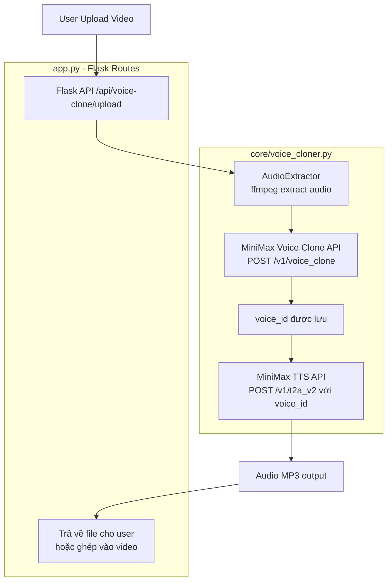
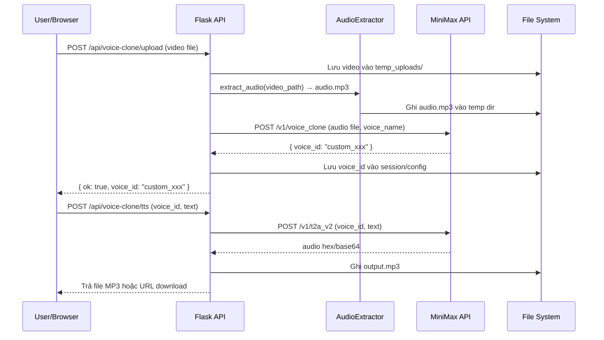
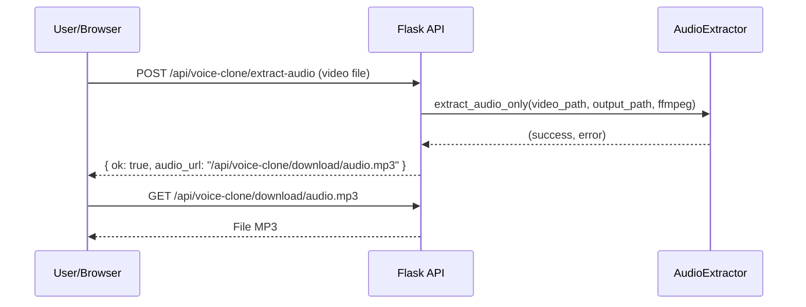

# Design Document: Voice Cloning TTS Pipeline

## Overview

Pipeline này cho phép người dùng upload một video, tự động trích xuất giọng nói từ video đó, clone giọng thành một voice profile mới thông qua MiniMax API, sau đó dùng chính giọng đã clone để tổng hợp giọng nói (TTS) cho nội dung mới. Kết quả cuối cùng là file audio (MP3) được tổng hợp bằng giọng clone, sẵn sàng để ghép lại vào video hoặc sử dụng độc lập.

Pipeline tích hợp vào hệ thống Flask/SocketIO hiện có, tái sử dụng `core/video_processor.py` cho bước tách audio và `MultiProviderTTS` cho bước TTS, đồng thời bổ sung module `core/voice_cloner.py` mới để giao tiếp với MiniMax Voice Cloning API.

---

## Architecture



---

## Sequence Diagrams

### Luồng chính: Upload → Clone → TTS



### Luồng tách audio từ video để dùng làm file âm thanh



---

## Components and Interfaces

### Component 1: `core/voice_cloner.py` — VoiceCloner

**Purpose**: Giao tiếp với MiniMax Voice Cloning API và TTS API. Đây là module mới cần tạo.

**Interface**:
```python
class VoiceCloner:
    def __init__(self, api_key: str, tts_model: str = "speech-2.8-hd")

    async def clone_voice(
        self,
        audio_path: Path,
        voice_name: str,
        description: str = "",
    ) -> tuple[bool, str, str]:
        """
        Upload audio sample lên MiniMax để tạo voice clone.
        Returns: (success, voice_id, error_message)
        """

    async def tts_with_cloned_voice(
        self,
        text: str,
        voice_id: str,
        out_path: Path,
        speed: float = 1.0,
        pitch: float = 0.0,
        volume: float = 1.0,
    ) -> tuple[bool, str]:
        """
        Tổng hợp giọng nói bằng voice đã clone.
        Returns: (success, error_message)
        """

    async def list_cloned_voices(self) -> list[dict]:
        """
        Lấy danh sách các voice đã clone.
        Returns: [{ "voice_id": str, "name": str, "created_at": str }]
        """

    async def delete_cloned_voice(self, voice_id: str) -> tuple[bool, str]:
        """
        Xóa voice đã clone.
        Returns: (success, error_message)
        """
```

**Responsibilities**:
- Gọi MiniMax `/v1/voice_clone` để upload audio sample và nhận `voice_id`
- Gọi MiniMax `/v1/t2a_v2` với `voice_id` tùy chỉnh để TTS
- Xử lý lỗi API, retry logic
- Parse response audio (hex decode → bytes → MP3)

---

### Component 2: `core/video_processor.py` — `extract_audio_only` (đã có)

**Purpose**: Tách audio từ video bằng ffmpeg. Hàm này đã tồn tại, chỉ cần tái sử dụng.

**Interface** (đã có sẵn):
```python
def extract_audio_only(
    video_path: Path,
    output_path: Path,
    ffmpeg: str,
) -> tuple[bool, str]:
    """Extract full audio track from video as MP3."""
```

---

### Component 3: Flask Routes trong `app.py`

**Purpose**: Expose HTTP endpoints cho voice cloning pipeline.

**Interface**:
```python
# Upload video → extract audio → clone voice
POST /api/voice-clone/upload
    Body: multipart/form-data { video: File, voice_name: str }
    Response: { ok: bool, voice_id: str, audio_url: str, error: str }

# TTS bằng giọng đã clone
POST /api/voice-clone/tts
    Body: { voice_id: str, text: str, speed: float, pitch: float }
    Response: { ok: bool, audio_url: str, error: str }

# Chỉ tách audio từ video (không clone)
POST /api/voice-clone/extract-audio
    Body: multipart/form-data { video: File }
    Response: { ok: bool, audio_url: str, duration: float, error: str }

# Lấy danh sách voices đã clone
GET /api/voice-clone/voices
    Response: { ok: bool, voices: [{ voice_id, name, created_at }] }

# Xóa voice
DELETE /api/voice-clone/voices/<voice_id>
    Response: { ok: bool, error: str }

# Download file audio
GET /api/voice-clone/download/<filename>
    Response: File MP3
```

---

## Data Models

### VoiceCloneJob

```python
@dataclass
class VoiceCloneJob:
    job_id: str           # UUID
    video_path: Path      # đường dẫn video gốc
    audio_path: Path      # đường dẫn audio đã tách
    voice_name: str       # tên voice clone
    voice_id: str         # voice_id từ MiniMax (rỗng nếu chưa clone)
    status: str           # "pending" | "extracting" | "cloning" | "done" | "error"
    error: str            # thông báo lỗi nếu có
    created_at: float     # timestamp
```

### TTSRequest

```python
@dataclass
class TTSRequest:
    voice_id: str         # voice_id từ MiniMax
    text: str             # văn bản cần TTS
    speed: float = 1.0    # tốc độ (0.5 - 2.0)
    pitch: float = 0.0    # pitch (-12 đến +12 semitones)
    volume: float = 1.0   # âm lượng (0.1 - 10.0)
    out_path: Path = None # đường dẫn output
```

### MiniMax API Endpoints

```python
MINIMAX_VOICE_CLONE_URL = "https://api.minimax.io/v1/voice_clone"
MINIMAX_TTS_URL         = "https://api.minimax.io/v1/t2a_v2"
MINIMAX_VOICES_URL      = "https://api.minimax.io/v1/get_voice"

# Voice Clone Request Body
{
    "file": <binary audio>,   # audio sample (MP3/WAV, 10s-300s)
    "voice_id": "custom_xxx", # tên voice tùy chọn
}

# TTS Request Body (với cloned voice)
{
    "model": "speech-2.8-hd",
    "text": "...",
    "stream": False,
    "voice_setting": {
        "voice_id": "custom_xxx",  # voice_id từ clone
        "speed": 1.0,
        "pitch": 0,
        "vol": 1.0,
    },
    "audio_setting": {
        "format": "mp3",
        "sample_rate": 32000,
        "bitrate": 128000,
        "channel": 1,
    }
}
```

---

## Algorithmic Pseudocode

### Thuật toán chính: Full Pipeline (Upload → Clone → TTS)

```pascal
ALGORITHM voice_clone_pipeline(video_file, voice_name, tts_text)
INPUT:
  video_file: UploadedFile
  voice_name: String
  tts_text: String (optional)
OUTPUT:
  result: { voice_id, audio_url, tts_url }

BEGIN
  // Bước 1: Lưu video upload
  job_id ← generate_uuid()
  video_path ← save_upload(video_file, temp_uploads / job_id)
  ASSERT video_path.exists()

  // Bước 2: Tách audio từ video
  audio_path ← temp_uploads / job_id / "sample.mp3"
  ok, err ← extract_audio_only(video_path, audio_path, ffmpeg)
  IF NOT ok THEN
    RETURN Error("Không thể tách audio: " + err)
  END IF
  ASSERT audio_path.exists() AND audio_path.size > 0

  // Bước 3: Clone voice qua MiniMax API
  ok, voice_id, err ← await clone_voice(audio_path, voice_name)
  IF NOT ok THEN
    RETURN Error("Voice cloning thất bại: " + err)
  END IF
  ASSERT voice_id != ""

  // Bước 4 (optional): TTS bằng giọng đã clone
  IF tts_text != "" THEN
    tts_path ← temp_uploads / job_id / "tts_output.mp3"
    ok, err ← await tts_with_cloned_voice(tts_text, voice_id, tts_path)
    IF NOT ok THEN
      RETURN Error("TTS thất bại: " + err)
    END IF
    RETURN { voice_id, audio_url: audio_path, tts_url: tts_path }
  END IF

  RETURN { voice_id, audio_url: audio_path, tts_url: null }
END
```

**Preconditions:**
- `video_file` là file hợp lệ (MP4, AVI, MOV, MKV)
- `voice_name` không rỗng, không chứa ký tự đặc biệt
- MiniMax API key hợp lệ và có trong config
- ffmpeg có trong PATH hoặc local

**Postconditions:**
- Nếu thành công: `voice_id` được lưu, audio files tồn tại trên disk
- Nếu thất bại: trả về error message rõ ràng, không để lại file rác

**Loop Invariants:** N/A (pipeline tuyến tính)

---

### Thuật toán: Clone Voice qua MiniMax

```pascal
ALGORITHM clone_voice(audio_path, voice_name)
INPUT:
  audio_path: Path (MP3/WAV audio sample)
  voice_name: String
OUTPUT:
  (success: bool, voice_id: str, error: str)

BEGIN
  // Validate audio duration
  duration ← get_media_duration_seconds(ffmpeg, audio_path)
  IF duration < 10 THEN
    RETURN (False, "", "Audio quá ngắn, cần ít nhất 10 giây")
  END IF
  IF duration > 300 THEN
    RETURN (False, "", "Audio quá dài, tối đa 300 giây")
  END IF

  // Gọi MiniMax Voice Clone API
  payload ← multipart_form {
    "file": open(audio_path, "rb"),
    "voice_id": voice_name,
  }
  headers ← { "Authorization": "Bearer " + api_key }

  FOR attempt IN 1..3 DO
    response ← await POST(MINIMAX_VOICE_CLONE_URL, payload, headers)
    IF response.status == 200 THEN
      data ← response.json()
      IF data.base_resp.status_code == 0 THEN
        RETURN (True, voice_name, "")
      ELSE
        error ← data.base_resp.status_msg
      END IF
    ELSE
      error ← "HTTP " + response.status
    END IF
    await sleep(1.0 * attempt)
  END FOR

  RETURN (False, "", error)
END
```

**Preconditions:**
- `audio_path` tồn tại và có thể đọc được
- `10 <= duration <= 300` giây
- `api_key` hợp lệ

**Postconditions:**
- Nếu thành công: MiniMax đã lưu voice với `voice_id = voice_name`
- Nếu thất bại sau 3 lần retry: trả về error message

**Loop Invariants:**
- Mỗi lần retry: `attempt` tăng dần, delay tăng theo

---

### Thuật toán: TTS với Cloned Voice

```pascal
ALGORITHM tts_with_cloned_voice(text, voice_id, out_path, speed, pitch, volume)
INPUT:
  text: String
  voice_id: String (từ clone_voice)
  out_path: Path
  speed: float (0.5 - 2.0)
  pitch: float (-12 - 12)
  volume: float (0.1 - 10.0)
OUTPUT:
  (success: bool, error: str)

BEGIN
  IF text == "" THEN
    RETURN (False, "Text không được rỗng")
  END IF

  payload ← {
    "model": MINIMAX_TTS_MODEL,
    "text": text,
    "stream": False,
    "voice_setting": {
      "voice_id": voice_id,
      "speed": clamp(speed, 0.5, 2.0),
      "pitch": clamp(pitch, -12, 12),
      "vol": clamp(volume, 0.1, 10.0),
    },
    "audio_setting": {
      "format": "mp3",
      "sample_rate": 32000,
      "bitrate": 128000,
      "channel": 1,
    }
  }
  headers ← { "Authorization": "Bearer " + api_key, "Content-Type": "application/json" }

  response ← await POST(MINIMAX_TTS_URL, payload, headers, timeout=60)
  IF response.status != 200 THEN
    RETURN (False, "HTTP " + response.status + ": " + response.text)
  END IF

  data ← response.json()
  audio_hex ← data.data.audio
  IF audio_hex == "" THEN
    RETURN (False, "Không có audio trong response")
  END IF

  audio_bytes ← hex_decode(audio_hex)
  write_bytes(out_path, audio_bytes)

  ASSERT out_path.exists() AND out_path.size > 0
  RETURN (True, "")
END
```

---

## Key Functions with Formal Specifications

### `extract_audio_only()` (đã có trong `video_processor.py`)

```python
def extract_audio_only(
    video_path: Path,
    output_path: Path,
    ffmpeg: str,
) -> tuple[bool, str]
```

**Preconditions:**
- `video_path` tồn tại và là file video hợp lệ
- `ffmpeg` là đường dẫn hợp lệ đến ffmpeg binary
- `output_path.parent` có thể tạo được

**Postconditions:**
- Nếu `True`: `output_path` tồn tại, là file MP3 hợp lệ, `size > 0`
- Nếu `False`: `str` chứa thông báo lỗi từ ffmpeg

---

### `VoiceCloner.clone_voice()`

```python
async def clone_voice(
    self,
    audio_path: Path,
    voice_name: str,
    description: str = "",
) -> tuple[bool, str, str]
```

**Preconditions:**
- `audio_path` tồn tại, là file audio (MP3/WAV)
- `10 <= duration(audio_path) <= 300` giây
- `voice_name` không rỗng, chỉ chứa `[a-zA-Z0-9_-]`
- `self.api_key` hợp lệ

**Postconditions:**
- Nếu `(True, voice_id, "")`: MiniMax đã đăng ký voice, `voice_id != ""`
- Nếu `(False, "", error)`: `error` mô tả nguyên nhân thất bại

---

### `VoiceCloner.tts_with_cloned_voice()`

```python
async def tts_with_cloned_voice(
    self,
    text: str,
    voice_id: str,
    out_path: Path,
    speed: float = 1.0,
    pitch: float = 0.0,
    volume: float = 1.0,
) -> tuple[bool, str]
```

**Preconditions:**
- `text` không rỗng
- `voice_id` là voice đã được clone thành công
- `0.5 <= speed <= 2.0`
- `-12 <= pitch <= 12`
- `0.1 <= volume <= 10.0`

**Postconditions:**
- Nếu `(True, "")`: `out_path` tồn tại, là file MP3 hợp lệ
- Nếu `(False, error)`: `out_path` không tồn tại hoặc rỗng

---

## Example Usage

```python
import asyncio
from pathlib import Path
from core.voice_cloner import VoiceCloner
from core.video_processor import extract_audio_only, find_ffmpeg

async def main():
    ffmpeg = find_ffmpeg()
    cloner = VoiceCloner(api_key="sk-api-xxx")

    # Bước 1: Tách audio từ video
    video_path = Path("input_video.mp4")
    audio_path = Path("temp/sample_audio.mp3")
    ok, err = extract_audio_only(video_path, audio_path, ffmpeg)
    assert ok, f"Tách audio thất bại: {err}"

    # Bước 2: Clone voice
    ok, voice_id, err = await cloner.clone_voice(
        audio_path=audio_path,
        voice_name="my_custom_voice",
    )
    assert ok, f"Clone voice thất bại: {err}"
    print(f"Voice ID: {voice_id}")  # "my_custom_voice"

    # Bước 3: TTS bằng giọng đã clone
    tts_out = Path("temp/tts_output.mp3")
    ok, err = await cloner.tts_with_cloned_voice(
        text="Xin chào, đây là giọng nói được clone từ video.",
        voice_id=voice_id,
        out_path=tts_out,
        speed=1.0,
    )
    assert ok, f"TTS thất bại: {err}"
    print(f"TTS output: {tts_out}")

asyncio.run(main())
```

---

## Correctness Properties

1. **Audio extraction integrity**: Với mọi video hợp lệ có audio track, `extract_audio_only()` phải trả về `(True, "")` và file output phải có `size > 0`.

2. **Voice clone idempotency**: Gọi `clone_voice()` với cùng `voice_name` hai lần không được gây lỗi crash — hoặc overwrite thành công, hoặc trả về error rõ ràng.

3. **TTS output validity**: Với mọi `voice_id` hợp lệ và `text` không rỗng, `tts_with_cloned_voice()` phải tạo ra file MP3 có thể phát được (size > 1KB).

4. **Error propagation**: Mọi lỗi từ MiniMax API phải được propagate lên caller dưới dạng `(False, error_message)`, không được raise exception uncaught.

5. **Temp file cleanup**: Sau khi pipeline hoàn thành (thành công hoặc thất bại), các file tạm trong `temp_uploads/{job_id}/` phải được dọn dẹp sau một khoảng thời gian (TTL).

---

## Error Handling

### Lỗi 1: Video không có audio track

**Condition**: Video upload không chứa audio stream  
**Detection**: `has_audio_track(video_path, ffmpeg)` trả về `False`  
**Response**: `{ ok: False, error: "Video không có audio track" }`  
**Recovery**: Yêu cầu user upload video khác

### Lỗi 2: Audio quá ngắn/dài cho voice cloning

**Condition**: `duration < 10s` hoặc `duration > 300s`  
**Detection**: Kiểm tra trước khi gọi API  
**Response**: `{ ok: False, error: "Audio cần từ 10-300 giây để clone voice" }`  
**Recovery**: Hướng dẫn user cắt/chọn đoạn audio phù hợp

### Lỗi 3: MiniMax API rate limit / quota

**Condition**: HTTP 429 hoặc `base_resp.status_code == 1002`  
**Detection**: Kiểm tra response status  
**Response**: Retry với exponential backoff (tối đa 3 lần)  
**Recovery**: Nếu vẫn thất bại, trả về error với hướng dẫn kiểm tra quota

### Lỗi 4: Voice ID không tồn tại khi TTS

**Condition**: `voice_id` đã bị xóa hoặc chưa được clone  
**Detection**: MiniMax trả về `base_resp.status_code != 0`  
**Response**: `{ ok: False, error: "Voice ID không hợp lệ, cần clone lại" }`  
**Recovery**: Redirect user về bước clone voice

### Lỗi 5: ffmpeg không tìm thấy

**Condition**: `find_ffmpeg()` trả về `None`  
**Detection**: Kiểm tra trước khi chạy pipeline  
**Response**: `{ ok: False, error: "ffmpeg không tìm thấy trong PATH" }`  
**Recovery**: Hướng dẫn cài đặt ffmpeg

---

## Testing Strategy

### Unit Testing

- Test `extract_audio_only()` với video có/không có audio track
- Test `clone_voice()` với mock MiniMax API (kiểm tra payload, headers)
- Test `tts_with_cloned_voice()` với mock response (hex decode, file write)
- Test validation logic: audio duration, voice_name format, text empty

### Property-Based Testing

**Property Test Library**: `hypothesis`

- **Property 1**: Với mọi `speed ∈ [0.5, 2.0]`, `pitch ∈ [-12, 12]`, `volume ∈ [0.1, 10.0]` — payload TTS luôn được tạo đúng format
- **Property 2**: Với mọi chuỗi hex hợp lệ, `bytes.fromhex(hex_str)` luôn decode thành công và `len(result) > 0`
- **Property 3**: Với mọi `voice_name` chỉ chứa `[a-zA-Z0-9_-]`, validation luôn pass

### Integration Testing

- Test full pipeline với video thật (mock MiniMax API)
- Test Flask endpoints với `test_client()`
- Test SocketIO progress events trong quá trình pipeline chạy

---

## Performance Considerations

- **Audio extraction**: ffmpeg chạy nhanh (~1-5s cho video 1 phút), không cần async
- **MiniMax Voice Clone API**: Có thể mất 5-30s tùy độ dài audio — cần chạy trong background thread và emit SocketIO progress
- **MiniMax TTS API**: Thường ~2-5s cho đoạn text ngắn — chấp nhận được cho synchronous call
- **File cleanup**: Dùng TTL-based cleanup (xóa files > 1 giờ) để tránh đầy disk
- **Concurrency**: Giới hạn 1 voice clone job tại một thời điểm để tránh rate limit

---

## Security Considerations

- **API Key**: MiniMax API key lưu trong `config.yml` (đã có pattern này), không expose ra frontend
- **File upload validation**: Kiểm tra MIME type và extension trước khi xử lý (chỉ chấp nhận video formats)
- **File size limit**: Giới hạn upload tối đa 500MB
- **Path traversal**: Dùng `secure_filename()` từ Werkzeug cho tên file upload
- **Temp file isolation**: Mỗi job có `job_id` UUID riêng, tránh conflict giữa các request

---

## HuggingFace TTS Engine

### Component: `core/hf_tts.py` — HuggingFaceTTS

**Purpose**: TTS engine mới dùng HuggingFace `transformers` pipeline, hỗ trợ các model như `facebook/mms-tts-vie` (tiếng Việt) và `microsoft/speecht5_tts`.

**Interface**:
```python
class HuggingFaceTTS:
    def __init__(
        self,
        hf_token: str,
        tts_model: str = "facebook/mms-tts-vie",
        device: str = "cpu",
        speaker_embeddings_path: str = "",
    )

    def synthesize(
        self,
        text: str,
        out_path: Path,
        language: str = "vi",
    ) -> tuple[bool, str]:
        """
        Tổng hợp giọng nói từ text dùng HuggingFace model.
        Returns: (success, error_message)
        """
```

**Config section** (`config.yml` và `default_config.py`):
```yaml
huggingface:
  hf_token: ""                    # fallback sang translation.hf_token nếu rỗng
  tts_model: "facebook/mms-tts-vie"
  tts_speaker_embeddings: ""      # optional, đường dẫn local
  device: "cpu"                   # hoặc "cuda"
```

**Tích hợp vào `video_processor.py`**:
- Trong `MultiProviderTTS` (hoặc hàm TTS dispatch), thêm nhánh `tts_engine == "huggingface"`
- Resolve token: `huggingface.hf_token` → fallback `translation.hf_token`
- Khởi tạo `HuggingFaceTTS` và gọi `synthesize()`

---

## Dependencies

| Dependency | Mục đích | Trạng thái |
|---|---|---|
| `transformers` | HuggingFace TTS pipeline | Cần cài thêm (`pip install transformers`) |
| `datasets` | Speaker embeddings cho SpeechT5 | Cần cài thêm nếu dùng `speecht5_tts` |
| `torch` | Backend cho HF models | Cần cài thêm |
| `ffmpeg` | Tách audio từ video | Đã có (dùng trong `video_processor.py`) |
| `aiohttp` | Gọi MiniMax API async | Đã có (dùng trong `_tts_minimax`) |
| `flask` | HTTP endpoints | Đã có |
| `flask-socketio` | Progress events | Đã có |
| `werkzeug` | `secure_filename` | Đã có (Flask dependency) |
| MiniMax API | Voice cloning + TTS | Cần thêm `voice_clone` endpoint |

Không cần thêm dependency mới — tất cả đã có sẵn trong project.
